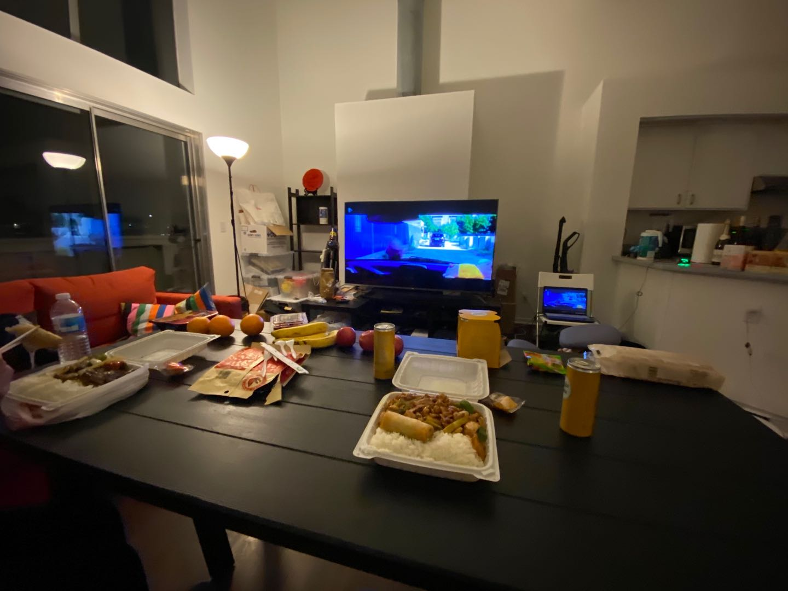

# Chaoren's Personal Website

A big 'thank you' from Yisong to Chaoren!!

Thank you for your lovely home🏠 and warm heart ❤️!!

I will always remember the happiness we had together at 2020 Feb!!!

A short intro to Chaoren by Yisong: 

>Chaoren is a nice gentleman. He holds a Bachelor degress from Southeast University and a master degree from Zhejiang University. He is now a software engineer leader at Google, solving major techinical problem with global impact!

Mutual friends between Chaoren and [Yisong](www.yisong.me) includes:

- [Zek Chang](www.twitter.com/zekchang) (CEO of [Gudoo](www.guduokeji.com), Chaoren's roommate in Southeast University)

I'm Sure Chaoren will have his own introduction after I transfer this domain name to him!

Finally, Chaoren, Enjoy your California home and have a wonderful life! 

Best, Yisong

